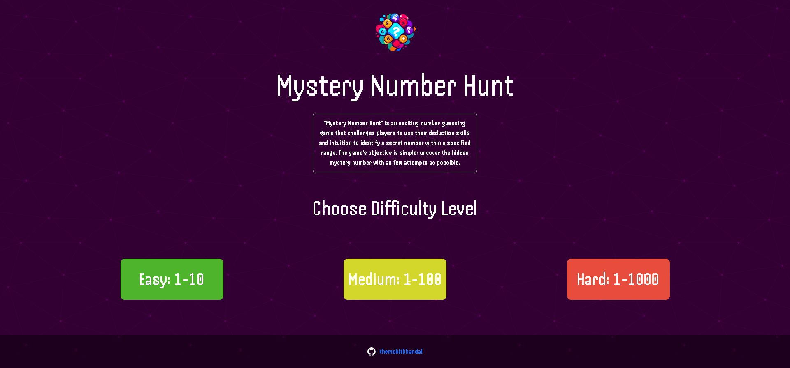

# Mystery Number Hunt

 

## 🀄️ Description

"Mystery Number Hunt" is an exciting number guessing game that challenges players to use their deduction skills and intuition to identify a secret number within a specified range. The game's objective is simple: uncover the hidden mystery number with as few attempts as possible.

## 🎮 Gameplay

- **Selecting Difficulty:** At the start of the game, players choose from different difficulty levels, each offering a specific range of numbers within which the mystery number lies. The range can vary from easy (e.g., 1 to 10) to difficult (e.g., 1 to 1000).

- **Discovering the Mystery Number:** Once the difficulty level is chosen, the game generates a secret number within the selected range. The player's task is to guess the mystery number based on clues given after each attempt.

- **Making Guesses:** Players take turns guessing the mystery number. They input their guesses using a user-friendly interface provided by the game. After each guess, the game provides feedback to guide the player closer to the correct answer.

- **Feedback and Clues:** After each guess, the game offers helpful hints to aid players in their pursuit of the mystery number. The feedback generally includes whether the guessed number is too high, too low, or correct. This information assists players in narrowing down the possibilities and making more informed guesses.

- **Limited Attempts:** The number of attempts allowed varies depending on the difficulty level chosen. Players must use their guesses strategically to uncover the mystery number within the allotted attempts. The fewer attempts they take, the higher their score will be.

- **Leaderboard and Competitions:** The game may include a global leaderboard to showcase the top players with the best scores. This fosters friendly competition among players worldwide and encourages them to improve their guessing skills.

## 🎲 Features

- Attractive and intuitive user interface.
- Various difficulty levels to accommodate players of all skill levels.
- Engaging sound effects and visuals to enhance the gaming experience.
- Option to play in single-player mode or challenge friends in multiplayer mode.
- An adaptive hint system to provide appropriate clues based on player performance.
- In-app purchases for cosmetic enhancements and additional features (if applicable).

## 🤖 How to run

1. Just go on this link to play the game [Mystery Number Hunt](https://mysterynumberhunt.netlify.app/).

## 📷 Screenshots

## 🙋🏻‍♂️ Contributing

We welcome contributions from the community to improve and enhance the game. If you find any bugs or have suggestions, please open an issue or submit a pull request.

---
**Note:** The screenshots used in this `README.md` file are for illustrative purposes only and may not represent the actual appearance of the game.
